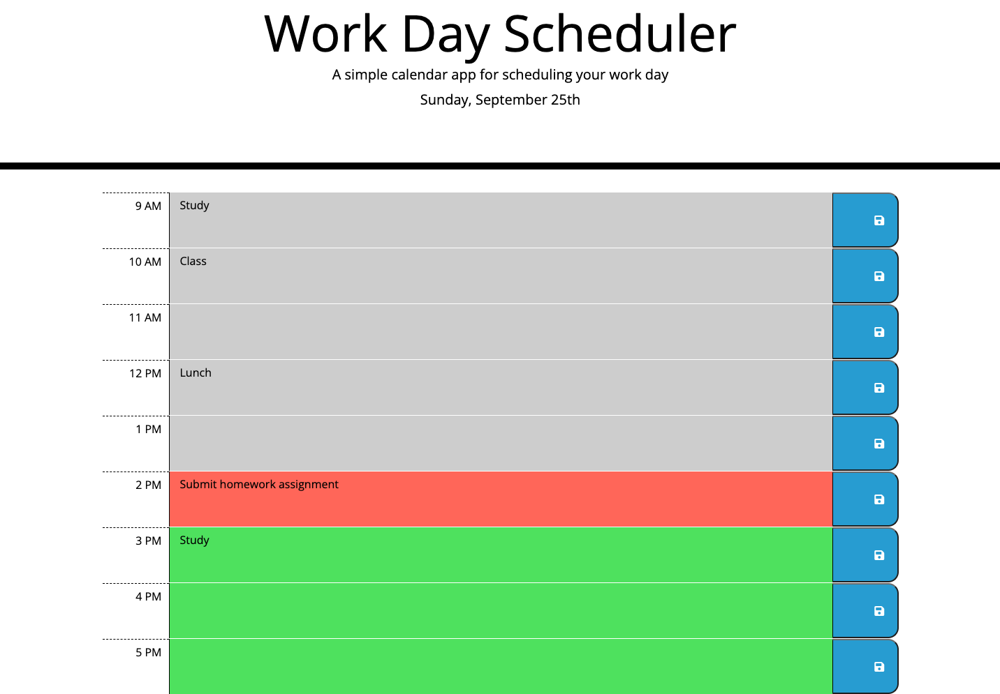

# Work Day Scheduler

## Description
The Work Day Scheduler is an application that allows users to keep track of the things they need to do each day.

The ability to save items for each hour into a convenient daily planner will help keep the user organized and able to manage their time.

The app demonstrates dynamic updates of the HTML and CSS using jQuery.

A date utility library (Moment.js) is used to manage the date and time, allowing the app to reflect an accurate display in real time. 

## Installation

N/A

## Usage

The Work Day Scheduler is easy to use and features 3 main components:

First, upon loading the application, timeblocks for the hours of 9am through 5pm display.

* Hours of the day that are in the past appear as gray timeblocks.
* The current hour appears as a red timeblock.
* Future hours of the day appear as green timeblocks.

Secondly, the timeblocks feature a text area for the user to enter information.
* Simply clicking into the text area allows the user to add their own text.

Lastly, the user can save the text they entered.
* Clicking the button with a floppy disc icon saves the text for that particular timeblock.
* Saved text items will remain on the page even after refreshing it.

The application utilizes a responsive layout to adapt to different screen sizes.

## Credits

N/A

## Link to Deployed Website

[Work Day Scheduler]()

## License

MIT License

Copyright (c) 2022 smdann

Please refer to the license in the repo for more information.